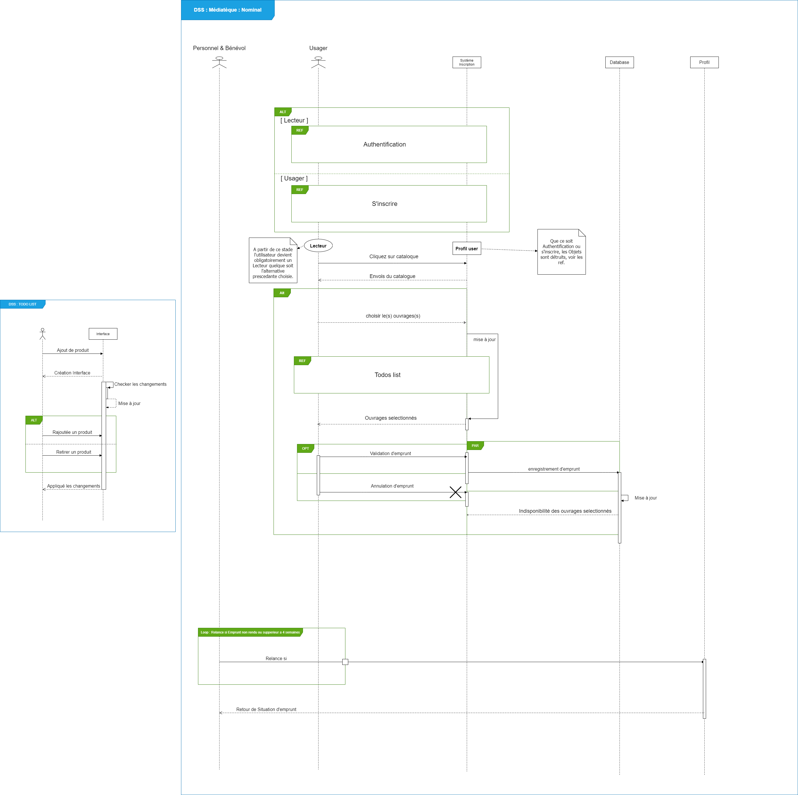
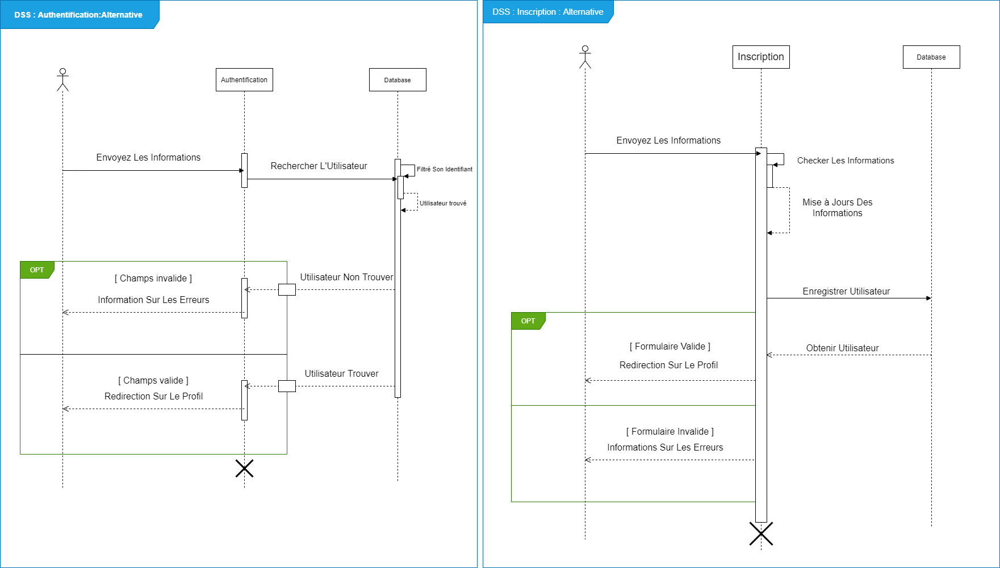

# Diagrammes : UML part 1

+  [Diagramme de cas d'utilisation](#DCU)

+ [Diagramme de séquence système](#DSS)

+ [Diagramme d'activitée](#DAC)

## Règles de gestion :

1. tout emprunteur doit posséder une carte de lecteur

2. tout emprunt de CD-Rom nécessite une caution

3. tout emprunt de microfilm nécessite un écran libre

4. tout document emprunté est enregistré (n° lecteur + côte document)

5. les enregistrements des emprunts peuvent être effectués soit par le personnel, soit par des bénévoles

6. les enregistrements des nouveaux documents ou des nouveaux lecteurs sont effectués uniquement par le personnel

7. les bénévoles n’ont accès à l’enregistrement des emprunts que sur une période déterminée

8. la côte d’un document et le n° d’un lecteur sont des numéros incrémentés à leur création

9. un lecteur ne peut emprunter que s'il a payé sa cotisation et n’a pas plus de 5 emprunts en cours

10. au delà de 4 semaines d’emprunt, une lettre de relance sera envoyé au lecteur

11. les documents perdus ou volés doivent être mis hors service

12. l’adresse d’un lecteur doit pouvoir être modifiée

13. les enregistrements lecteur et document ne sont pas supprimables

14. les lecteurs peuvent consulter selon plusieurs critères les documents et leurs disponibilités

15. le personnel peut consulter la situation de chaque lecteur

    

    _____

    ## <a id="DCU">Diagramme de cas d'utilisation</a>
    
    
    
    _____
    
    
    
    ## <a id="DSS">Diagramme de séquence système</a>
    
    ### Diagramme flux principal : 

### Fragment du flux principal (Authentification) : 

### DSS Alternatif (Register User)  :

###  

### DSS Alternatif (Register Documents ) : 

_____

## <a id="DAC">Diagramme d' activitée</a>

### 